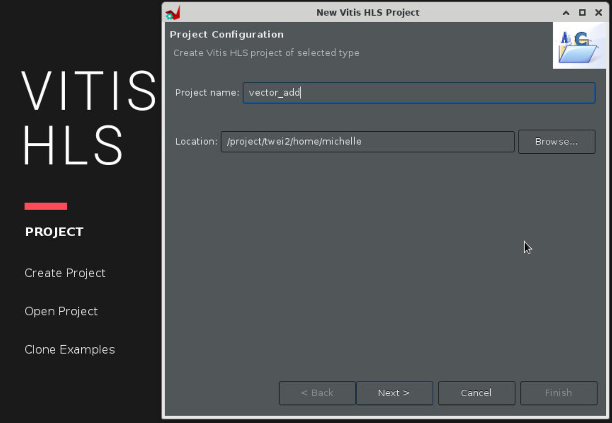

# Create Vitis HLS Project

## Step 1

<!--
-[HLS Tutotial](https://akshaykamath.notion.site/HLS-Tutorial-dc7e388dc31641fba5002012e3e69204)
-->

Vitis GUI should open as shown below.

<div align=center></div>


Create a new project and specify the project name `vector_add`.

<div align=center></div>

## Step 2

It is not necessary to specify the top function nor the testbench now. Click on `Next` twice.

<div align=center></div>

<div align=center></div>

## Step 3

Change part selection to **Pynq-Z2** using the part number `xc7z020clg400-1` as shown below. This is the FPGA board we will be using for our lab assignments.

<div align=center></div>

<div align=center></div>

Note: Pynq-Z2 is a beginner’s board featuring Xilinx Zynq-7000 SoC supporting the Pynq (Python for Zynq) framework that makes it easier to run host applications on the board using Python language and libraries.

## Step 4

No need to change the `Solution Name` or the `Period`. We will continue with 100 MHz default clock frequency.
Then click "Finish".

You should see a window like the one shown below.

<div align=center></div>

## Step 5

Now, we can design our accelerator in **C++** and simulate with Vitis. To do so, start by creating a new source file named `top.c` in your desired folder as the following:

<div align=center></div>

```C++
// top.c
void top(int a[100], int b[100], int sum[100])
{
	#pragma HLS interface m_axi port=a depth=100 offset=slave bundle = A
	#pragma HLS interface m_axi port=b depth=100 offset=slave bundle = B
	#pragma HLS interface m_axi port=sum depth=100 offset=slave bundle = SUM

  #pragma HLS interface s_axilite register port=return

    for (int i = 0; i < 100; i++)
    {
		sum[i] = a[i] + b[i];
    }
}
```

## Step 6

Next, create a textbench named `main.c` as the following:

<div align=center></div>

```C++
// main.c
#include <stdio.h>

void top( int a[100], int b[100], int sum[100]);

int main()
{
    int a[100];
    int b[100];
    int c[100];

    for(int i = 0; i < 100; i++)
    {
        a[i] = i;
        b[i] = i * 2;
        c[i] = 0;
    }

    // Call the DUT function, i.e., your adder
    top(a, b, c);

    // verify the results
    int pass = 1;
    for(int j = 0; j < 100; j++)
    {
        if(c[j] != (a[j] + b[j]))
            {
                    pass = 0;
            }
            printf("A[%d] = %d; B[%d] = %d; Sum C[%d] = %d\n", j, a[j], j, b[j], j, c[j]);
    }

    if(pass)
    printf("Test Passed! :) \n");
    else
        printf("Test Failed :( \n");

    return 0;
}
```

Note: Test bench does not get synthesized. So you are free to use any C/C++ construct for your testing purposes!


## Step 7

Let's run C simulation for our adder module.

Click **Run C simulation** and then click **OK**.

<div align=center></div>

<div align=center></div>

## Step 8

Now that the simulation has passed, let's run high-level synthesis and generate the RTL for our adder. Go to `Project Settings > Synthesis`, and specify `top.c` as the top function.

<div align=center></div>

<div align=center></div>

## Step 9

Run synthesis

Click **Run C Synthesis** and set the **Period** to be 10, then click **OK**.

<div align=center></div>

## Step 10

Check the console window to know when the synthesis finishes.

<div align=center></div>

## Step 11

We can now view the performance reports and resource utilisation.

<div align=center></div>

## Step 12

C/RTL co-simulation can also be run at this stage. Vitis uses the same test bench `main.c` to test the RTL generated. This is left as an exercise. We will now export our adder “IP” for integration in Vivado.

Click **Export RTL** under "IMPLEMENTATION", then click **OK**.

<div align=center></div>

Note that the "Export Formart" should choose "Vivado IP (.zip)".

Then you will see the `Finished Export RTL/Implementation` in the console window, and find the 'export.zip' in the '~/vector_add/vectoe_add/solution1/impl/export.zip'.

**That’s it. We should now move to Vivado to generate the bitstream with our exported adder IP!**
