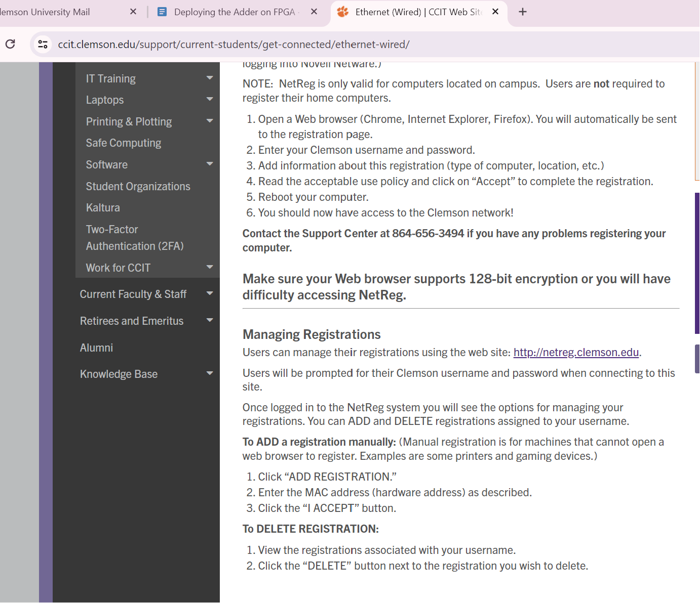
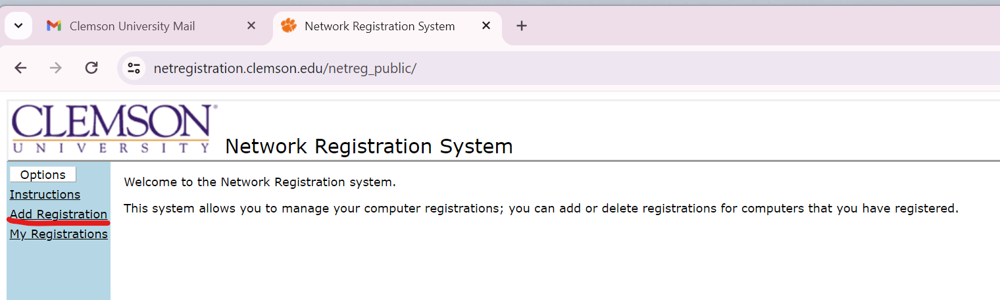
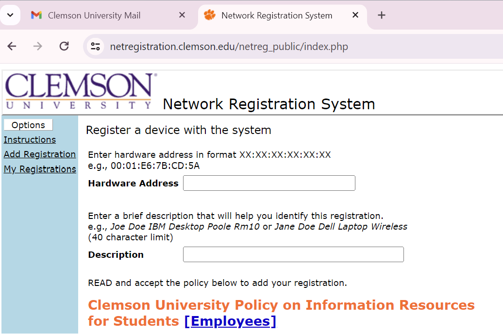

# Deploying the Adder on FPGA

## Step 1

If you have not used the PYNQ before, check the following link for setup:

-[PYNQ-Z2 Setup Guide](https://pynq.readthedocs.io/en/latest/getting_started/pynq_z2_setup.html).

-[Optional] Additionally, we can enhance the usability of PYNQ on campus through the following approach:

* Firstly, we need to connect the PYNQ by the Serial Port Terminal (like MobXterm), and we need to set some parameters like below:

  <div align=center></div>

  <div align=center></div>

  If we connect the PYNQ successfully, we will see like below:

 <div align=center></div>

* Secondly, we need to know some information about the PYNQ-Z2 board by print ```ifconfig``` like below.

   <div align=center></div>
   
And we need to copy the address above.
  
* Thirdly, we need to click the link for setup:
-[Clemson Ethernet](https://ccit.clemson.edu/support/current-students/get-connected/ethernet-wired/)

* Then, click the link like below:

  <div align=center></div>
  
  <div align=center></div>

  <div align=center></div>
  
We must paste the IP address in the ```Hardware Address```. We can write something in the ```Description ``` to mark our device. Accessing the school network through connecting to the school's Ethernet cable is currently the most convenient way. Then even if we don't have the board with us, we can still remotely access PYNQ by knowing the board's IP address, provided that the board is connected to the school network and powered on. 

<div align=center></div>

## Step 2

If you already have a basic idea of Jupyter on these boards, upload the `.bit` file and the `.hwh` file to Jupyter. In the same folder, create a new `.ipynb` file for writing the script.

-[Overlay Tutorial](https://pynq.readthedocs.io/en/latest/overlay_design_methodology/overlay_tutorial.html)

## Step 3

Find the address offset of the memory ports (`a`, `b`, and `sum`, in this example). This information can be found in the `xtop_hw.h` file under `solution1/impl/misc/drivers/top_v1_0/src` directory.

<div align=center></div>

## Step 4

Below is the example Python host code to control the FPGA kernel.

```python
import numpy as np
import pynq
from pynq import MMIO

overlay = pynq.Overlay('adder.bit')

top_ip = overlay.top_0
top_ip.signature

a_buffer = pynq.allocate((100), np.int32)
b_buffer = pynq.allocate((100), np.int32)
sum_buffer = pynq.allocate((100), np.int32)

# initialize input
for i in range (0, 100):
    a_buffer[i] = i
    b_buffer[i] = i+5

aptr = a_buffer.physical_address
bptr = b_buffer.physical_address
sumptr = sum_buffer.physical_address

# specify the address
# These addresses can be found in the generated .v file: top_control_s_axi.v
top_ip.write(0x10, aptr)
top_ip.write(0x1c, bptr)
top_ip.write(0x28, sumptr)


# start the HLS kernel
top_ip.write(0x00, 1)
isready = top_ip.read(0x00)

while( isready == 1 ):
    isready = top_ip.read(0x00)

print("Array A:")
print(a_buffer[0:10])
print("\nArray B:")
print(b_buffer[0:10])

print("\nExpected Sum:")
print((a_buffer + b_buffer)[0:10])

print("\nFPGA returns:")
print(sum_buffer[0:10])
```
